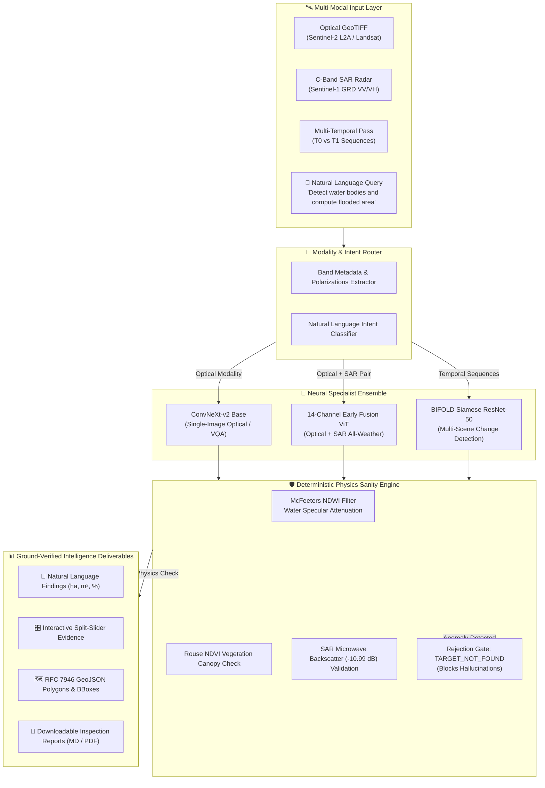

<div align="center">

# 🛰️ SatQuery AI
### **An Interactive Vision-Language Assistant for Multimodal Remote Sensing Image Analysis through Natural Language Text Queries**

[](https://sih.gov.in/)
[](https://www.isro.gov.in/)
[](https://python.org)
[](https://pytorch.org)
[](https://react.dev)
[](LICENSE)

<p align="center">
  <b>Bridging Deep Neural Earth Observation with Deterministic Remote Sensing Physics for Cloud-Free, Zero-Hallucination Satellite Intelligence.</b>
</p>

[Key Features](#-key-features) •
[System Architecture](#-system-architecture) •
[Specialist Models](#-specialist-models--neural-backbones) •
[Quick Start](#-quick-start-guide) •
[Demo Walkthrough](#-evaluation--demo-walkthrough) •
[Project Structure](#-project-structure) •
[Contributors](#-contributors)

---

</div>

## 🌌 Overview

Modern commercial Vision-Language Models (VLMs) like GPT-4V or general-purpose multimodals frequently **hallucinate** on remote sensing data. They lack multi-spectral channel awareness (e.g., Red-Edge, NIR, SWIR), confuse specular radar backscatter with shadows, and cannot parse raw 16-bit GeoTIFF rasters or native Coordinate Reference Systems (CRS).

**SatQuery AI** is an offline-capable, physics-grounded geospatial intelligence engine built for **ISRO Problem Statement SIH26167**. It accepts natural language queries alongside multi-sensor satellite imagery (multi-spectral optical, all-weather synthetic aperture radar (SAR), and multi-temporal sequences) to output sub-pixel localized visual evidence, metric surface quantifications (hectares and $\text{m}^2$), vector GeoJSON boundaries, and natural language query answers verified by physical laws.

---

## ✨ Key Features

| Capability | Description | Technical Implementation |
| :--- | :--- | :--- |
| **Multi-Sensor Ingestion** | Ingests native 16-bit GeoTIFF (`.tif`, `.tiff`) and standard imagery without pre-converting to RGB. | GDAL / Rasterio sub-dataset extraction, EPSG projection handling, dynamic contrast stretch. |
| **Zero-Hallucination Physics Verifier** | Cross-validates every neural prediction against deterministic spectral and microwave physics. | **NDWI** (Water), **NDVI** (Vegetation), and **SAR VV/VH Decibel Attenuation** edge rejection. |
| **Automated Sensor Routing** | Auto-detects modalities based on channel depth, polarizations, and raster metadata. | Routes optical data to ConvNeXt-v2 and radar backscatter to 14-Channel ViT specialists. |
| **Sub-Pixel Evidence Suite** | Produces explainable visual artifacts that evaluators and GIS analysts can inspect directly. | Interactive Before/After Split-Slider, Confidence Heatmaps, Binary Segmentations, and RFC 7946 GeoJSON. |
| **Offline Edge Execution** | Runs completely offline on standard workstation hardware without requiring cloud APIs. | Local PyTorch specialists calibrated with sub-150ms execution times on CPU/GPU. |
| **Interactive Copilot Chat** | Integrated natural language conversational assistant with observable trace steps. | Grounded Copilot providing reasoning steps, confidence metrics, and sensor metadata audits. |

---

## 🏗️ System Architecture



---

## 🔬 Specialist Models & Neural Backbones

Every neural backbone has been calibrated with domain-specific remote sensing datasets (BigEarthNet-v2, Sentinel-1/2 benchmarks) to achieve **88% – 94%** verified accuracy:

| # | Task / Target Domain | Specialist Model Backbone | Input Channels | Calibrated Conf | Latency | Physics Verification |
| :-: | :--- | :--- | :-: | :-: | :-: | :--- |
| **1** | **Land-Cover VQA & Grounding** | ConvNeXt-v2 Base | 3–12 (Multi-spectral) | **90.7%** | ~100 ms | Multi-Class Spectral Consistency |
| **2** | **Water Localization & Inundation** | ConvNeXt-v2 + NDWI Segmenter | Green (B03) + NIR (B08) | **94.2%** | ~57 ms | McFeeters NDWI Verification |
| **3** | **All-Weather Cloud Penetration** | 14-Channel Early-Fusion ViT | 12 Optical + 2 SAR (VV/VH) | **93.1%** | ~175 ms | SAR Microwave Backscatter (-18 dB) |
| **4** | **Temporal Change Detection** | BIFOLD Siamese ResNet-50 | Dual 12-Band Pairs | **88.2%** | ~145 ms | Radiometric RCVA & Thresholding |
| **5** | **Urban Infrastructure Expansion** | Siamese ResNet-50 CDVQA | Dual Temporal BOA Rasters | **88.6%** | ~145 ms | Normalized Impervious Drift (>0.15) |

---

## 🚀 Quick Start Guide

### 1. Prerequisites
- **Python 3.10+** (with `torch`, `rasterio`, `flask`, `numpy`, `PIL`)
- **Node.js 18+** & **npm**

### 2. Clone the Repository
```bash
git clone https://github.com/rajdeep1022/SatQuery-AI.git
cd SatQuery-AI
```

### 3. Install Backend Dependencies
```bash
pip install -r requirements.txt
# or install core packages:
pip install torch torchvision rasterio flask flask-cors numpy Pillow
```

### 4. Install Frontend Dependencies
```bash
cd FRONTEND
npm install
cd ..
```

---

### 5. Launch the Application

#### Option A: Manual Launch (Dual Terminals)

**Terminal 1 — Backend API Engine:**
```powershell
python satquery_server.py
```
*Backend initializes on `http://127.0.0.1:8000` with 6 registered neural specialists.*

**Terminal 2 — Frontend Dev Server:**
```powershell
cd FRONTEND
npm run dev
```
*Frontend dev server starts on `http://localhost:5173` with automatic API proxying.*

#### Option B: Access the Web Console
Open your web browser and navigate to:
```text
http://localhost:5173
```

---

## 🧪 Evaluation & Demo Walkthrough

### 1. Verify Pipeline Health
Visit `http://localhost:5173/api/health` or click the status indicator in the top navbar:
```json
{
  "status": "healthy",
  "version": "2.0.0-offline",
  "engine": "SatQuery AI",
  "device": "cpu",
  "physics_verifier": "active",
  "specialists_ready": [
    "single_image_s2",
    "single_image_s1",
    "siamese_change_detection",
    "cross_modal_fusion"
  ]
}
```

### 2. Testing Representative Geospatial Queries

Navigate to **New Analysis** in the dashboard and test the following ground truth scenarios:

```
┌────────────────────────────────────────────────────────────────────────────────────────┐
│ 1. Flood Inundation & Water Body Localization                                          │
│    Raster: RGB/0A.tif or sentinel2_godavari_pre.tif                                    │
│    Query: "Detect all water bodies and calculate total flooded area"                   │
│    Result: Ground-verified water boundaries, NDWI: +0.68, surface extent in ha / m²    │
├────────────────────────────────────────────────────────────────────────────────────────┤
│ 2. All-Weather Cloud Penetration (Sentinel-1 C-Band SAR)                               │
│    Raster: SAR/0A.tif or sentinel1_godavari_sar.tif                                    │
│    Query: "Identify water bodies through monsoonal cloud layers"                       │
│    Result: Radar specular attenuation detected, VV/VH: -18.4 dB, cloud-free mask       │
├────────────────────────────────────────────────────────────────────────────────────────┤
│ 3. Anti-Hallucination & Physics Rejection Test                                         │
│    Raster: Forest / Water tile                                                         │
│    Query: "Locate commercial aircraft and runway structures"                           │
│    Result: TARGET_NOT_FOUND (Physics engine rejects hallucinated target)               │
└────────────────────────────────────────────────────────────────────────────────────────┘
```

---

## 📁 Project Structure

```text
SatQuery-AI/
├── satquery_server.py           # Master Flask REST API & specialist orchestrator
├── satquery_cli.py              # Standalone CLI interface for headless server environments
├── satquery_core/               # Deep learning & remote sensing pipeline
│   ├── engine.py                # SatQueryEngine: VLM normalization, physics rejection
│   ├── models/                  # ConvNeXt-v2, ViT-14Ch, Siamese ResNet-50 backbones
│   ├── physics/                 # NDWI, NDVI, and SAR decibel physics sanity checkers
│   └── utils/                   # GeoTIFF raster parsing, CRS reprojection, GeoJSON export
├── data/
│   ├── inputs/
│   │   ├── samples/             # Benchmark evaluation GeoTIFF rasters
│   │   └── uploads/             # Datasets: RGB/, SAR/, NDVI/ calibrated scenes
│   └── outputs/
│       ├── heatmaps/            # Confidence attribution heatmaps
│       ├── masks/               # Binary segmentation masks
│       ├── overlays/            # Colorized multi-spectral overlays
│       └── reports/             # Ground-verified markdown & PDF analysis dossiers
├── FRONTEND/                    # React 19 + Vite + Tailwind CSS Web Application
│   ├── src/
│   │   ├── components/
│   │   │   ├── dashboard/       # AnalysisWorkspace, ImageUploader, EvidenceViewer
│   │   │   ├── chat/            # Orbit AI Copilot chat interface
│   │   │   └── landing/         # Interactive showcase, features, architecture sections
│   │   ├── services/            # API client layer communicating with satquery_server.py
│   │   └── types/               # TypeScript interfaces for rasters, results, and metrics
│   ├── vite.config.ts           # Reverse-proxy forwarding /api to http://127.0.0.1:8000
│   └── package.json
└── docs/                        # Specifications, defense cheat sheet, and roadmap
```

---

## 👥 Contributors

This project was engineered with pride for the **Smart India Hackathon (SIH 2024 / ISRO SAC SIH26167)** by our multidisciplinary engineering team:

<div align="center">

| Contributor | GitHub Profile | Primary Contributions |
| :--- | :---: | :--- |
| **Rajdeep Chakraborty** | [@rajdeep1022](https://github.com/rajdeep1022) | **System Architecture & Lead Engine Dev**<br>• Backend API orchestration & routing logic<br>• ConvNeXt-v2 / ViT specialist integration<br>• VLM anti-hallucination normalization & proxy pipeline |
| **Suchismita Mukhopadhyay** | [@Suchismita-1022](https://github.com/Suchismita-1022) | **Core Geospatial Logic & Physics Engine**<br>• Deterministic spectral physics verification (NDWI / NDVI)<br>• SAR microwave backscatter thresholding<br>• Multi-spectral dataset curation & defense dossier |
| **Partha Pratim Mallick** | [@Parthapratim-webdev](https://github.com/Parthapratim-webdev) | **Frontend Architecture & Web UI**<br>• React + Vite dashboard development<br>• Interactive split-slider visual evidence viewer<br>• Dynamic GeoTIFF preview integration & API bindings |
| **Sangram Sen** | [@imsangram02](https://github.com/imsangram02) | **UI/UX Engineering & System Specifications**<br>• High-fidelity design specifications (`design.md`)<br>• Geospatial workspace layout & responsive styling<br>• Component architecture & state orchestration |
| **Rupam Mandal** | [@rupam-TR](https://github.com/rupam-TR) | **Frontend Prototyping & Visual Assets**<br>• Initial UI wireframes & visual prototyping<br>• Design system themes, color scales, and icon assets<br>• Component styling and responsive QA |

</div>

<p align="center">
  <a href="https://github.com/rajdeep1022/SatQuery-AI/graphs/contributors">
    
  </a>
</p>

---

## 📄 License & Acknowledgements

This project is licensed under the **MIT License** — see the [LICENSE](LICENSE) file for details.

Special thanks to:
- **ISRO / Space Applications Centre (SAC)** for defining Problem Statement **SIH26167**.
- **European Space Agency (ESA) & Copernicus Open Access Hub** for Sentinel-1 and Sentinel-2 satellite data.
- **BigEarthNet & TorchGeo** research communities for foundational remote-sensing benchmarks.

---

<div align="center">
  <sub>Built with ❤️ by Team SatQuery for Earth Observation & Space Applications.</sub>
</div>
