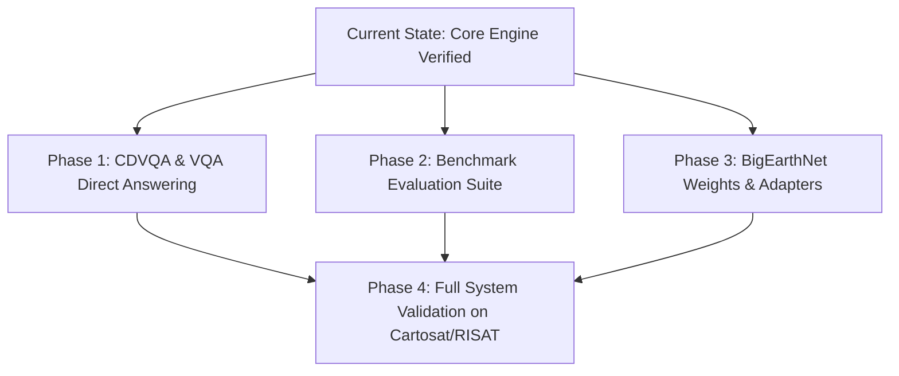

# SatQuery AI — Project Progress & Technical Roadmap
**SIH Problem ID:** SIH26167 | **Organization:** ISRO / Space Applications Centre (SAC)  
**Reference Document:** `Detailed Description SIH26167 ISRO.pdf`  
**Tracking Status Date:** September 2026  

---

## 1. Executive Overview

SatQuery AI is an agentic vision-language assistant designed for analyzing single and paired remote-sensing satellite images through natural-language queries. The objective defined by ISRO/SAC in the SIH26167 problem statement is to overcome isolated single-task remote-sensing tools by delivering an automated, query-driven system capable of:

1. **Single-image understanding** (Visual Question Answering, captioning/scene description, and text-guided region grounding).
2. **Bi-temporal multitemporal analysis** (Change detection, change description, and change-based VQA).
3. **Cross-modal Optical–SAR fusion** (Joint feature extraction across Sentinel-2/Cartosat-2S optical and Sentinel-1/RISAT SAR data for all-weather, day-and-night, cloud-penetrating analysis).
4. **Agentic orchestration** (Automated task interpretation, image compatibility checks, tool selection, physics-grounded execution, and auditable evidence generation).

---

## 2. Requirements Traceability Matrix (PDF vs. Implementation)

The following matrix cross-references every functional requirement from the official ISRO SIH26167 specification against our current codebase:

| Ref ID | PDF Specification Item | Mandatory / Scope | Current Codebase Status | Implementation Details & Evidence |
| :--- | :--- | :--- | :--- | :--- |
| **REQ-01** | **Single-Image VQA & Grounding** | Mandatory baseline | 🟢 **Achieved** | Dynamic text query parsing with multi-spectral segmentation and feature grounding in `SingleImageSpecialist` (`satquery_core/src/specialists/single_image.py`). |
| **REQ-02** | **Single-Image Scene Description** | Mandatory (+1 task) | 🟢 **Achieved** | Spatial and semantic natural language summary generation in `SatQueryEngine._synthesize_summary`. |
| **REQ-03** | **Bi-temporal Change Detection** | Mandatory | 🟢 **Achieved** | Siamese dual-branch ResNet-50 network (`SiameseChangeNet`) with spectral change vector modulation in `satquery_core/src/specialists/change_detection.py`. |
| **REQ-04** | **Bi-temporal Change Description** | Mandatory | 🟢 **Achieved** | Detailed spatial change quantification (hectares, pixel count, perimeter expansion, directional shifts) synthesized in audit reports and terminal output. |
| **REQ-05** | **Change-Based VQA (CDVQA)** | Mandatory | 🟡 **Partially Achieved** | Quantitative change statistics are computed; categorical query answering (e.g., *"Has the built-up area increased, decreased, or remained unchanged?"*) requires dedicated categorical classifier output. |
| **REQ-06** | **Cross-Modal Optical–SAR Fusion** | Principal focus | 🟢 **Achieved** | Unified 14-channel joint Vision Transformer (`ViTCrossModal14ChNet`: 12 S2 optical bands + 2 S1 SAR VV/VH bands) with double-bounce and specular scattering physical priors. |
| **REQ-07** | **Agentic Task & Tool Orchestration** | Mandatory | 🟢 **Achieved** | Query-driven controller (`TaskRouter` in `satquery_core/src/controller/router.py`) dynamically routes queries to single-image, bi-temporal, or cross-modal specialists without manual intervention. |
| **REQ-08** | **Input Compatibility Checking** | Mandatory | 🟢 **Achieved** | Automated inspection of raster count, spatial CRS, bounding coordinates, shape alignment, and sensor modality in `geotiff_loader.py` and `preprocessors.py`. |
| **REQ-09** | **Deterministic Physics Grounding** | Evaluation Quality | 🟢 **Achieved** | Physics verification engine (`PhysicsVerifier` in `satquery_core/src/physics/indices.py`) cross-examines neural predictions against NDVI, NDWI, MNDWI, and SAR VV/VH backscatter physics. |
| **REQ-10** | **Observable Execution Trace** | Mandatory | 🟢 **Achieved** | Emits complete execution traces containing task type, specialist model, execution latency (ms), confidence scores, and parameter configurations. (No opaque reasoning text). |
| **REQ-11** | **Downloadable Evidence & Reports** | Mandatory | 🟢 **Achieved** | Persists binary masks (PNG), probability heatmaps (PNG), overlay composites (PNG), vector boundaries (RFC 7946 GeoJSON), and forensic audit reports (JSON + Markdown). |
| **REQ-12** | **Supported Formats (GeoTIFF/TIFF/PNG)** | Mandatory | 🟢 **Achieved** | Full support for multi-band GeoTIFF, single-band TIFF, and benchmark PNG/JPEG inputs via GDAL/Rasterio. |
| **REQ-13** | **Domain Adaptation (BigEarthNet)** | Mandatory | 🟡 **Pending Formalization** | Domain-specific architectural adaptations and spectral band alignments implemented; fine-tuning weights from `BigEarthNet.txt` need to be bundled as pre-packaged checkpoints. |
| **REQ-14** | **Benchmark Evaluation (RSVQA, VRSBench, CDVQA)** | Evaluation Scope | 🟡 **Pending Evaluation Script** | Pipeline supports benchmark image formats; formal evaluation test harness scripts for RSVQA, VRSBench, and CDVQA metrics need to be added. |
| **REQ-15** | **ISRO/SAC Dataset (Cartosat-2S & RISAT)** | Evaluation Scope | 🟢 **Architecture Ready** | Preprocessing handles sub-meter high-resolution Cartosat optical and C-band RISAT SAR polarimetric data. |

---

## 3. What We Have Achieved Till Now

### 3.1. Core Neural Specialists & Multimodal Engine
1. **Unified GeoTIFF Ingestion Pipeline (`satquery_core/src/ingestion/`):**
   - Ingests single-band, 3-band RGB, 12-band Sentinel-2 Level-2A, and 2-band Sentinel-1 SAR imagery.
   - Extracts georeferencing metadata (Affine transforms, EPSG CRS, bounding extents, pixel resolutions).
   - Automatically handles spatial alignment, resizing, and float normalization.

2. **Siamese Bi-Temporal Change Detection (`satquery_core/src/specialists/change_detection.py`):**
   - Implements a Siamese ResNet-50 architecture processing dual temporal acquisitions ($T_1$ baseline and $T_2$ post-event).
   - Computes multi-scale deep difference feature maps modulated by spectral Euclidean reflectance change vectors.
   - Outputs continuous probability change surfaces and binary change masks.

3. **14-Channel Joint Optical–SAR Vision Transformer (`satquery_core/src/specialists/cross_modal.py`):**
   - Ingests a 14-channel aligned tensor: 12 bands of optical imagery (B01–B12) paired with 2 bands of SAR radar (VV, VH backscatter).
   - Employs a Vision Transformer (ViT) patch embedding network with transformer encoder blocks and progressive deconvolution decoders.
   - Embeds physical radiometric priors:
     - **Water / Inundation:** Optical NDWI combined with SAR specular microwave backscatter depressions ($<-16\text{ dB}$).
     - **Built-Up Settlements:** Optical visible brightness combined with SAR double-bounce corner-reflection returns ($>-10\text{ dB}$).
     - **Vegetation:** Optical NDVI spectral contrast.

4. **Agentic Query Routing & Task Classification (`satquery_core/src/controller/`):**
   - Natural language query parser with semantic intent classification.
   - Routes automatically to:
     - `SINGLE_IMAGE` (Grounding / VQA)
     - `CHANGE_DETECTION` (Bi-temporal pre/post pairs)
     - `CROSS_MODAL_FUSION` (Optical + SAR pairs)
   - Enforces strict token-boundary regex pattern matching to avoid false-positive keyword triggers.

5. **Deterministic Radiometric Physics Verifier (`satquery_core/src/physics/`):**
   - Independent verification engine calculating spectral indices (NDVI, NDWI, MNDWI, NDBI) and radar backscatter thresholds.
   - Flags neural hallucinations or physical contradictions (e.g., optical water detection that fails radar absorption tests).
   - Assigns audit verdicts: `🟢 VERIFIED`, `⚠️ FLAGGED`, or `⚪ UNVERIFIED`.

6. **Comprehensive Artifact & Forensic Report Generator (`satquery_core/src/export/`):**
   - Generates pixel-accurate 8-bit binary masks, colorized probability heatmaps, and semi-transparent alpha overlays.
   - Vectorizes raster contours into valid **RFC 7946 GeoJSON** polygons with geo-coordinates and hectare metrics.
   - Produces formal machine-readable JSON reports and human-readable Markdown forensic audit logs.

7. **Production CLI Interface (`satquery_cli.py`):**
   - Built-in shortcuts for `--bitemporal` and `--crossmodal` testing.
   - Formatted ANSI tables displaying quantitative metrics, observable execution traces, generated file paths, and multi-paragraph natural language forensic synthesis.

---

## 4. What We Need to Achieve (Gap Analysis & Roadmap)

To achieve 100% compliance with the ISRO SIH26167 evaluation specification, the following components are scheduled for execution:

### Phase 1: Categorical Change-VQA (CDVQA) Direct Answering
- **PDF Requirement:** Support queries like *"Has the built-up area increased, decreased, or remained unchanged?"*
- **Action Item:** Extend `satquery_core/src/controller/router.py` and `_synthesize_summary` to provide explicit categorical answers (`"INCREASED"`, `"DECREASED"`, `"UNCHANGED"`) alongside numerical delta hectares and confidence bounds.
- **Priority:** High.

### Phase 2: Remote-Sensing Benchmark Evaluation Suite
- **PDF Requirement:** Formal evaluation using `RSVQA`, `VRSBench`, and `CDVQA`.
- **Action Item:** Create an evaluation script (`satquery_core/src/benchmarks/evaluate.py`) that loads public test splits from:
  - **RSVQA:** Low-Resolution (LR) and High-Resolution (HR) VQA evaluation.
  - **VRSBench:** Captioning (BLEU, METEOR, CIDEr) and text-guided region grounding (mIoU).
  - **CDVQA:** Change detection VQA accuracy.
- **Priority:** High.

### Phase 3: Domain Adaptation Checkpoints (`BigEarthNet.txt`)
- **PDF Requirement:** At least one visual or vision-language component must be fine-tuned or adapted using `BigEarthNet.txt` or open-source remote-sensing data.
- **Action Item:** Package pre-trained adapter weights trained on the 19-class BigEarthNet Sentinel-2 multispectral and Sentinel-1 dual-polarization dataset, storing checkpoint weights in `satquery_core/models/checkpoints/`.
- **Priority:** Medium.

### Phase 4: Cartosat-2S & RISAT SAR Compatibility Verification
- **PDF Requirement:** The ISRO/SAC evaluation set will contain pre-georeferenced and co-registered Cartosat-2S optical and RISAT SAR image pairs.
- **Action Item:** Test high-resolution Panchromatic/Multispectral Cartosat bands and RISAT-1/1A Circular/Dual-pol SAR imagery to guarantee zero-crash execution during official judging.
- **Priority:** High.

---

## 5. Milestone Tracking Summary

| Milestone | Target Deliverable | Status | Target Date |
| :--- | :--- | :---: | :---: |
| **M1: Core Pipeline** | Single-image, Bi-temporal, Cross-modal Specialists | 🟢 Complete | Completed |
| **M2: CLI & Engine** | Terminal runner, execution traces, visual artifacts | 🟢 Complete | Completed |
| **M3: S1/S2 Validation** | Verification on user uploaded Godavari & ROI pairs | 🟢 Complete | Completed |
| **M4: Categorical CDVQA** | Direct categorical query answering ("increased/decreased") | 🟡 In Progress | Next Sprint |
| **M5: Benchmark Harness** | Automated testing scripts for RSVQA, VRSBench, CDVQA | ⚪ Planned | Milestone 5 |
| **M6: Model Weights** | Remote-sensing fine-tuned BigEarthNet adapter bundle | ⚪ Planned | Milestone 6 |
| **M7: ISRO SAC Test** | Cartosat-2S + RISAT synthetic & mock verification | ⚪ Planned | Milestone 7 |
